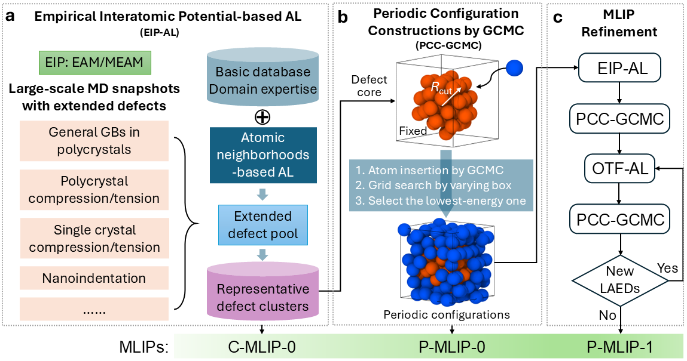

# Modeling Extensive Defects in Metals through Classical Potential-Guided Sampling and Automated Configuration Reconstruction

This repository provides instructions, data, and models for modeling extensive defects in metals using machine learning techniques.
# Overview
Extended defects such as dislocation networks and general grain boundaries are ubiquitous in metals, and accurately modeling these extensive defects is crucial for understanding their deformation mechanisms. Existing machine learning interatomic potentials (MLIPs) often fall short in adequately describing these defects, as their significant characteristic sizes exceed the computational limits of first-principles calculations. In this study, we address these challenges by establishing a comprehensive defect genome through empirical interatomic potential-guided active machine learning. To further enable accurate first-principles calculations on this defect genome, we have developed an automated configuration reconstruction technique. This method transforms defect atomic clusters into periodic configurations through precise atom insertion, utilizing Grand Canonical Monte Carlo simulations. These strategies enable the development of highly accurate and transferable MLIPs for modeling extensive defects in metals.
# OS Requirements
Linux/Mac OSX/Windows
# Software Requirements
1. LAMMPS https://github.com/lammps/lammps.git
2. Moment Tensor Potential (MTP) development
   https://gitlab.com/ashapeev/mlip-2.git;   
   https://gitlab.com/ashapeev/interface-lammps-mlip-2.git
3. Active learning based on D-optimality
   https://gitlab.com/ashapeev/mlip-3.git;
   https://gitlab.com/ivannovikov/interface-lammps-mlip-3.git
4. Atomic Cluster Expansion (ACE) potential development
   https://pacemaker.readthedocs.io/en/latest/
# Installation Guide
The installation instructions for each package or software can be found in the links above.
# Demo
Script folder.
# Citation
If you utilize the potentials, EIP-AL, or PCC-GCMC from this repository, please cite the following:
https://www.nature.com/articles/s41524-025-01599-1
